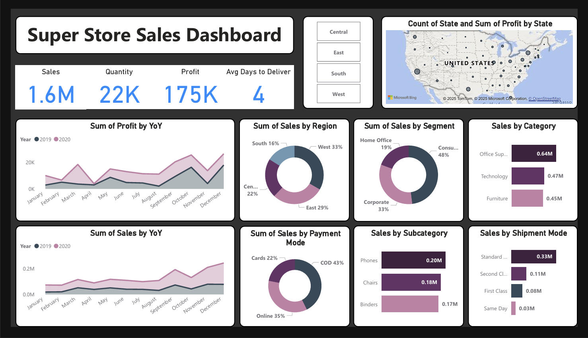
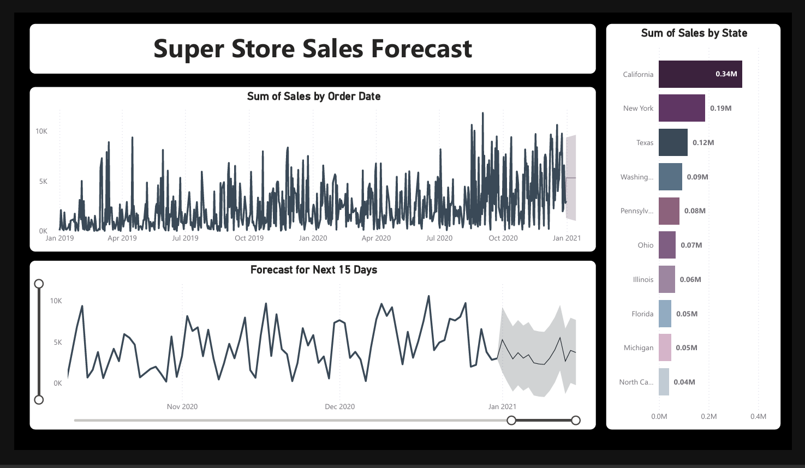

# Super Store Sales Dashboard - Power BI Project  

## 📊 Overview  
This Power BI project is a comprehensive sales dashboard analyzing the performance of a Super Store across various categories, subcategories, shipment modes, regions, and timeframes. The dashboard provides insights into:  

- Sales, Profit, and Quantity metrics  
- Sales trends by Year-over-Year (YoY) comparison  
- Performance by region, category, and payment mode  
- Forecasting for the next 15 days  
- Shipment and delivery performance analysis  

## 🛠️ Tools Used  
- **Power BI Desktop** for data visualization and reporting  
- **DAX & Power Query** for data transformation  
- **Microsoft Excel** as the data source  

## 📌 Features  
✅ Sales analysis by category, subcategory, and shipment mode  
✅ Year-over-Year (YoY) sales and profit comparison  
✅ Regional sales distribution with interactive maps  
✅ Forecasting sales for the next 15 days  
✅ Payment mode analysis for transaction trends  

## 📷 Dashboard Preview  



## 📥 Installation & Usage  
1. Download and install **Power BI Desktop**  
2. Clone this repository:  
   ```sh
   git clone https://github.com/yourusername/powerbi-sales-dashboard.git
